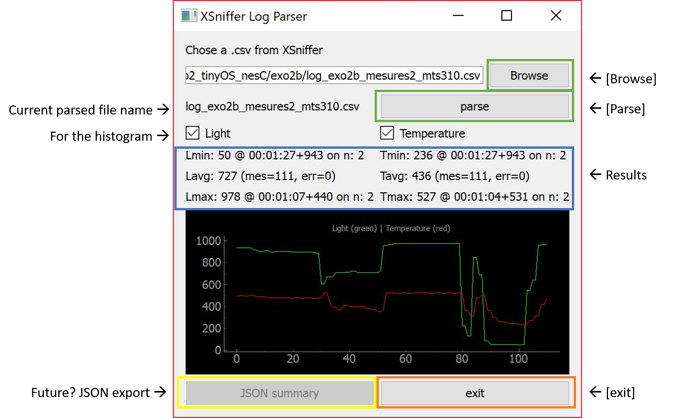

# XSnifferLogParser
XSniffer Motes Light and Temp Parser

Usage: 

- Clic the [Browse] button to select a .csv file, formatted with the XSniffer-Motes style (Light on rows '9' and '10', temperature on rows '7' and '8', and 'ElapsedTime', 'msec', '2' rows)
- Clic the [Parse] buttun to parse the selected file. The min, max and average will be displayed on the window.
- The [Exit] button closes the app.

History and motivation:
For a ADR's course in the last semester of Embedded Systems at HEIG-VD, we had to fetch the min, max and average of light measures froms sensors.
At first we sugested to simply use Excel (or equivalent) to import, convert and calculate "by hand" the data, but it was suggested we write a small python script to parse the data.

Finally I decide to discover Python scripting and GUI usages, and this small project was the perfect pretext.
